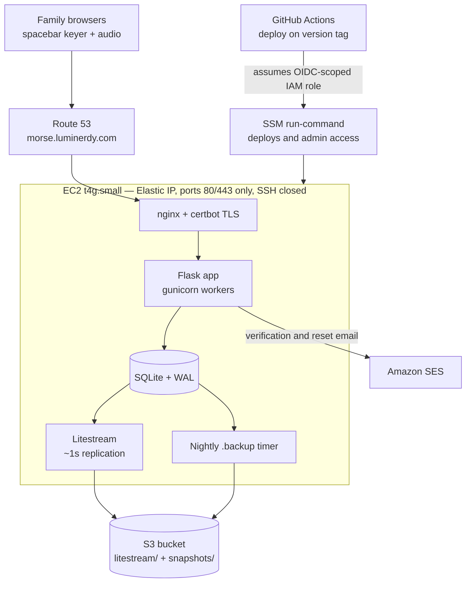

# Deploying morseWeb to EC2 (Phase 3 runbook)

Everything repo-side lives in `deploy/`. This document is the AWS-side
checklist, in order. Estimated cost: t4g.small (~$12/mo) + Route 53
hosted zone ($0.50/mo) + domain (~$12/yr) + S3/SES (pennies).

## Architecture



The database is protected twice: Litestream streams every write to S3
continuously, and a systemd timer uploads a full snapshot nightly. A
dead instance is recovered with the restore drill at the bottom of
this document.

## 1. S3 bucket

Create a private bucket for backups, e.g. `morseweb-backups-<suffix>`:

- Block all public access (the default).
- Add a lifecycle rule expiring the `snapshots/` prefix after 30 days.
  (Litestream manages its own retention under `litestream/`.)

## 2. IAM role for the instance

Create role `morseweb-ec2` (trusted entity: EC2) with:

- **AmazonSSMManagedInstanceCore** (managed policy) - Session Manager
  access, no SSH port needed.
- An inline policy for the bucket and SES:

```json
{
  "Version": "2012-10-17",
  "Statement": [
    {
      "Effect": "Allow",
      "Action": ["s3:GetObject", "s3:PutObject", "s3:DeleteObject"],
      "Resource": "arn:aws:s3:::YOUR_BUCKET/*"
    },
    {
      "Effect": "Allow",
      "Action": ["s3:ListBucket", "s3:GetBucketLocation"],
      "Resource": "arn:aws:s3:::YOUR_BUCKET"
    },
    {
      "Effect": "Allow",
      "Action": ["ses:SendEmail"],
      "Resource": "*"
    }
  ]
}
```

## 3. Launch the instance

- AMI: Ubuntu Server 24.04 LTS, **arm64**.
- Type: `t4g.small`.
- IAM instance profile: `morseweb-ec2`.
- Security group: inbound **80 and 443 from 0.0.0.0/0 only**. No port
  22 - Session Manager replaces SSH (this mirrors the morsePi SSM
  setup).
- Storage: default 8 GB gp3 is fine.

Connect with Session Manager (Console -> EC2 -> Connect, or
`aws ssm start-session --target i-...`).

## 4. Provision

From an SSM session:

```bash
sudo -i
git clone https://github.com/luminerdy/morseWeb.git /tmp/morseweb-bootstrap
DOMAIN=morse.example.com BUCKET=YOUR_BUCKET \
    bash /tmp/morseweb-bootstrap/deploy/setup_server.sh
```

The script installs packages, creates the `morseweb` user, clones the
app to `/opt/morseweb/app`, builds the venv, generates
`/etc/morseweb/env` (secret key included), installs Litestream, and
enables the `morseweb`, `litestream`, and nightly backup units.

Check: `curl -s http://127.0.0.1:8000/healthz` -> `{"status":"ok"}`.

## 5. Domain and TLS

1. Route 53: hosted zone for your domain; **A record** -> the
   instance's Elastic IP (allocate one first so reboots keep the
   address).
2. Once DNS resolves: `sudo certbot --nginx -d morse.example.com`.
   Certbot adds the TLS block and HTTP->HTTPS redirect, and installs
   its own renewal timer.

## 6. SES

1. SES console -> verified identities -> verify your **domain** (adds
   DKIM records to Route 53 automatically if you let it).
2. `MORSEWEB_EMAIL_FROM` in `/etc/morseweb/env` must be at that domain
   (setup_server.sh defaults to `morseweb@$DOMAIN`).
3. New SES accounts start in the **sandbox** (can only email verified
   addresses). That is fine for family testing; request production
   access before Phase 4 open signup.

## 7. First admin

```bash
sudo -u morseweb /opt/morseweb/venv/bin/python \
    /opt/morseweb/app/scripts/make_admin.py you@example.com
```

(Sign up through the site first; this promotes and verifies you.)

## 8. GitHub deploys

1. IAM -> Identity providers -> add GitHub OIDC provider
   (`token.actions.githubusercontent.com`).
2. Create role `morseweb-github-deploy` trusted by
   `repo:luminerdy/morseWeb:*` with an inline policy allowing
   `ssm:SendCommand` (on the instance and the `AWS-RunShellScript`
   document) and `ssm:GetCommandInvocation`.
3. Repo secrets: `AWS_DEPLOY_ROLE_ARN`, `AWS_REGION`,
   `EC2_INSTANCE_ID`.
4. Deploy by pushing a tag (`git tag v1.0.0 && git push --tags`) or
   running the **deploy** workflow manually. It checks out the ref,
   installs deps, restarts, and fails the run if `/healthz` does not
   come back.

## 9. CloudWatch (monitoring)

- Install the CloudWatch agent if you want journal logs shipped;
  minimum viable: an alarm on `StatusCheckFailed` for the instance and
  a metric filter/alarm on the backup timer (`systemctl status
  morseweb-backup.timer`).
- Uptime checks and 5xx alarms are Phase 4 scope.

## Restore drill (Phase 3 exit criterion)

Prove a dead instance loses at most seconds of data:

1. Note the current state (e.g. an attempt count from `/admin`).
2. Terminate the instance. Yes, really.
3. Launch a replacement (steps 3-4 above; same role, same bucket).
4. On the new instance, **before starting the app**:

   ```bash
   sudo systemctl stop morseweb litestream
   sudo -u morseweb litestream restore \
       -o /opt/morseweb/app/data/morseweb.sqlite3 \
       s3://YOUR_BUCKET/litestream/morseweb
   sudo systemctl start litestream morseweb
   ```

5. Move the Elastic IP to the new instance; certbot certs can be
   re-issued (`certbot --nginx -d ...`) since Let's Encrypt is free.
6. Verify the noted state survived. Fallback if Litestream's replica
   is ever unusable: pull the newest nightly from
   `s3://YOUR_BUCKET/snapshots/`.

Do this drill once before telling the family the site exists.
